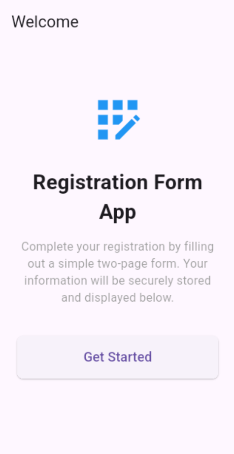
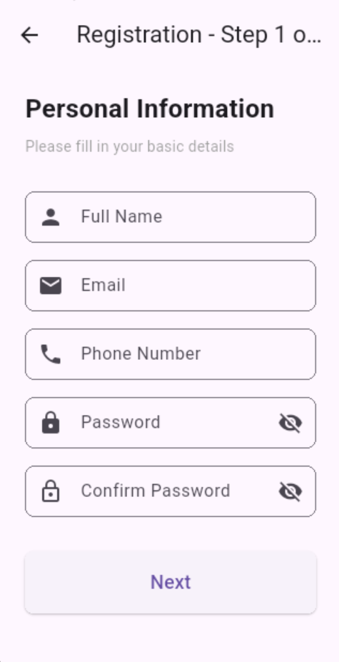
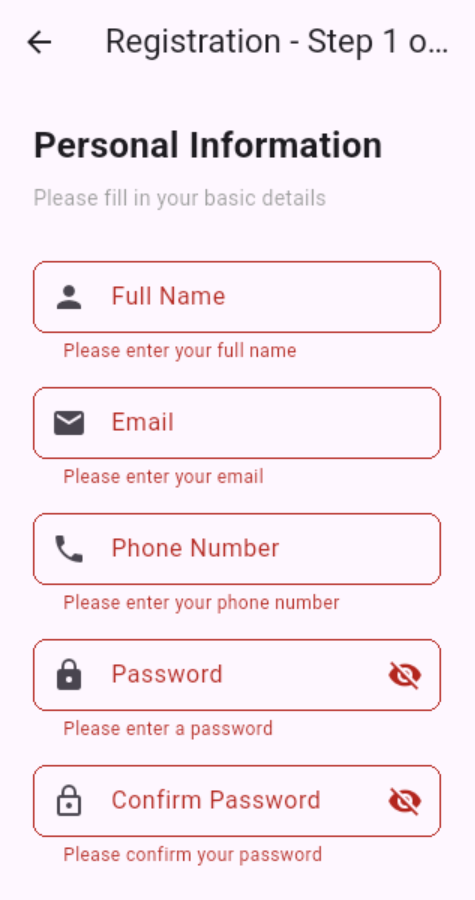
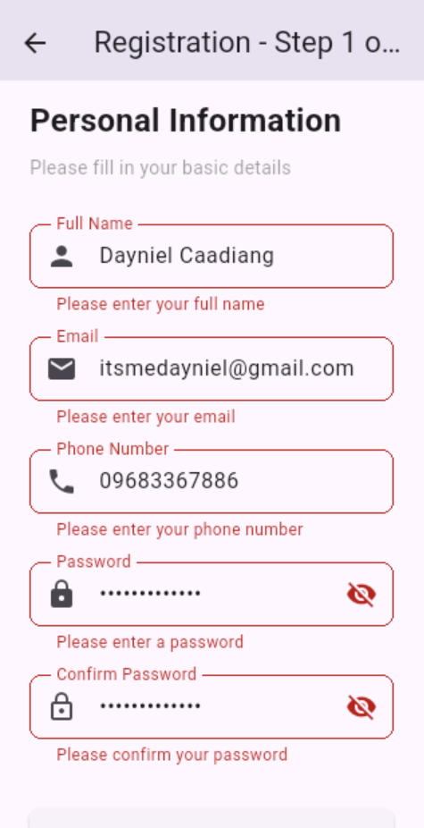
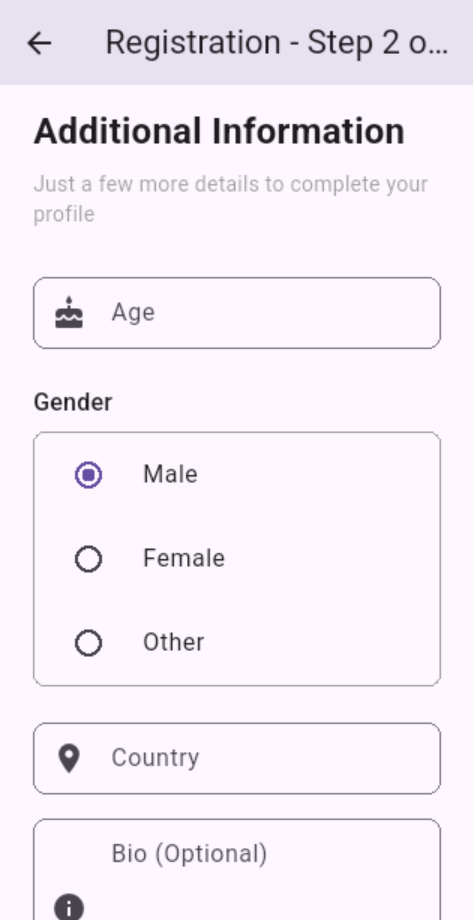
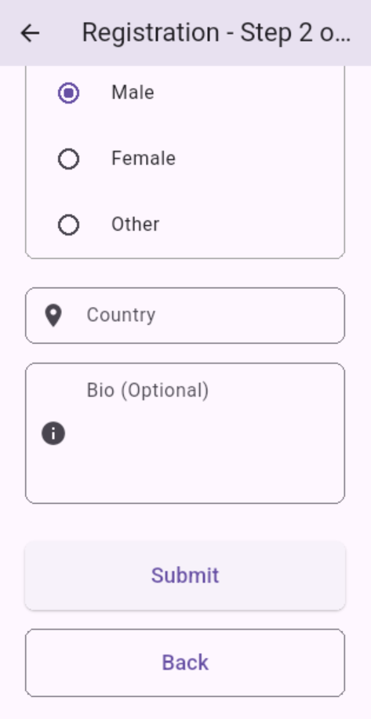
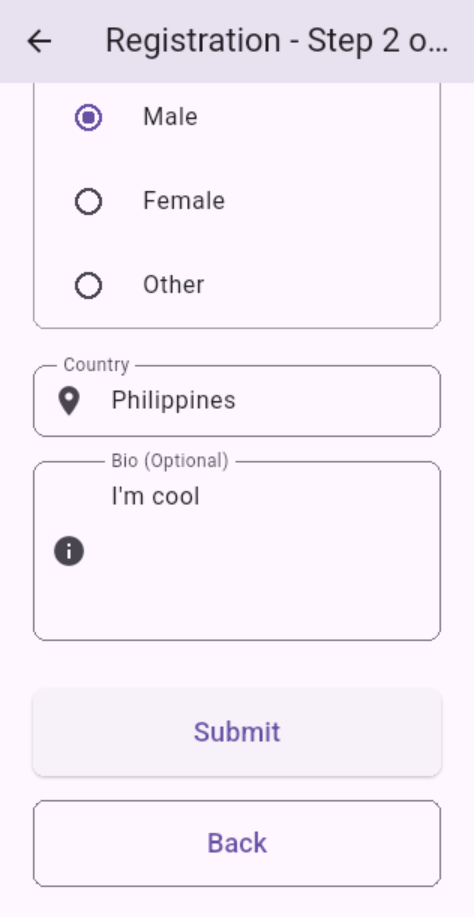
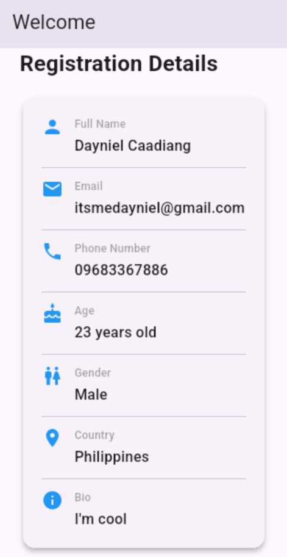

# Multi-Page Registration Form (Flutter)

## Description
A multi-screen registration application built using Flutter.  
The app demonstrates navigation between screens, form validation, and data passing across multiple pages.  
Users complete a two-page registration form with their personal and additional information, which is then displayed on the home screen after successful submission.

---

## Features
- **Welcome/Home Screen** with app description and navigation button
- **Two-Page Registration Form**
  - Page 1: Personal information (Name, Email, Phone, Password)
  - Page 2: Additional details (Age, Gender, Country, Bio)
- **Comprehensive Form Validation**
  - Name must be at least 3 characters
  - Valid email format required
  - Phone number minimum 10 digits
  - Password minimum 6 characters with confirmation matching
  - Age must be 18 or older
- **Interactive Elements**
  - Password visibility toggle buttons
  - Radio button gender selection
  - Form error messages with real-time feedback
- **Data Display**
  - Beautiful card layout showing all submitted registration details
  - Icons for each data field
- **Proper Navigation Flow**
  - Data passing from Page 1 → Page 2 → Home Screen
  - Back navigation handling

---

## Screenshots










---

## Project Structure

```
lib/
├── main.dart
├── models/
│   └── user_data.dart
└── screens/
    ├── home_screen.dart
    ├── registration_page1.dart
    └── registration_page2.dart
```

---

## Validation Rules

| Field | Requirements |
|-------|-------------|
| Full Name | Required, minimum 3 characters |
| Email | Required, valid email format |
| Phone Number | Required, minimum 10 digits |
| Password | Required, minimum 6 characters |
| Confirm Password | Must match password |
| Age | Required, must be 18+ |
| Gender | Required (Radio selection) |
| Country | Required |
| Bio | Optional |

---

## How to Run

1. Create a new Flutter project:
   ```bash
   flutter create registration_form
   cd registration_form
   ```

2. Replace the `lib` folder with the provided files

3. Run the app:
   ```bash
   flutter pub get
   flutter run
   ```

---

## Challenges Faced
- Making sure user data entered on Page 1 successfully reaches Page 2, and then returns to the home screen after submission
- Implementing proper password confirmation validation
- Ensuring the information travels correctly back through all screens without getting lost

---

## What I Learned
- How to move between different pages and carry information along with you
- Creating rules that check if users fill out forms correctly (like valid emails, matching passwords, etc.)
- Understanding how to update what users see on screen when they interact with the app
- Separating different parts of the app into their own files to keep everything clean and manageable
- Adding helpful features like showing/hiding passwords and displaying appropriate keyboards for different input types